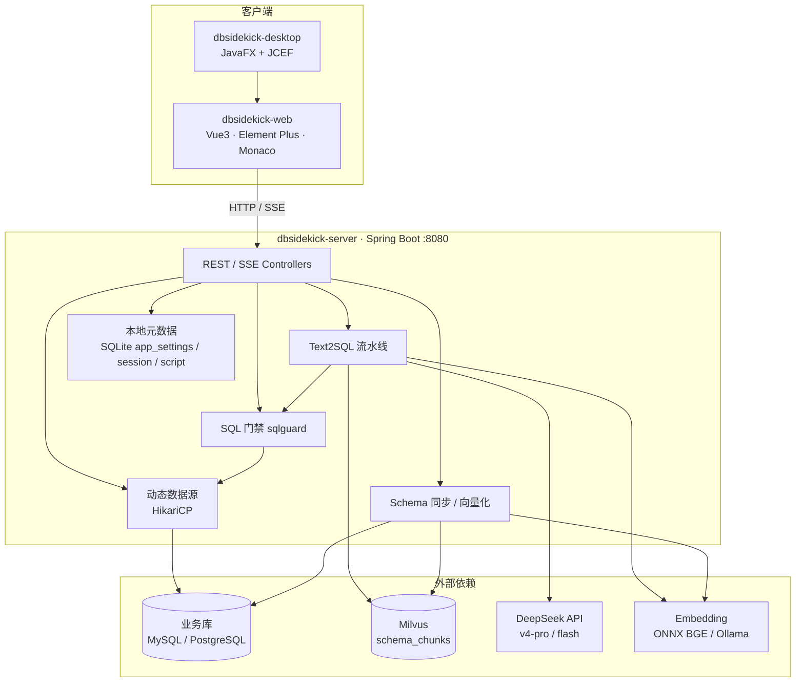
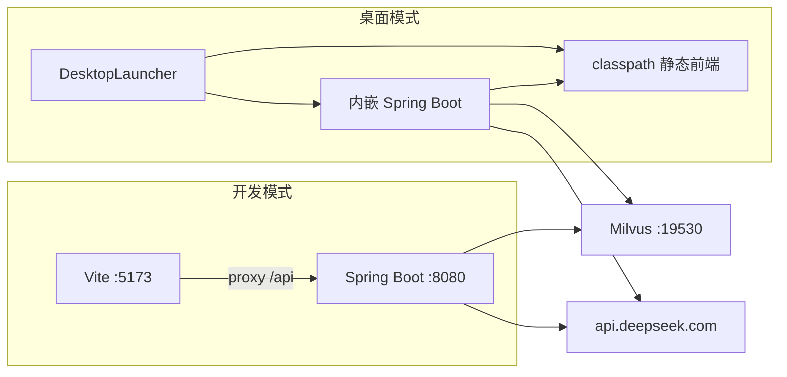
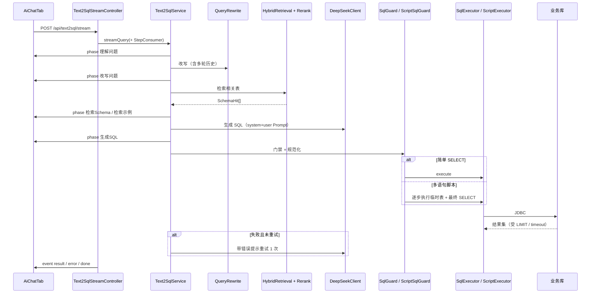
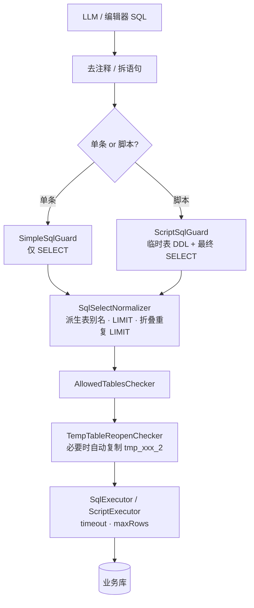
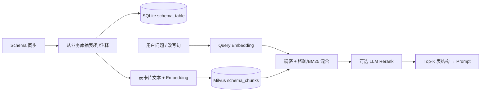
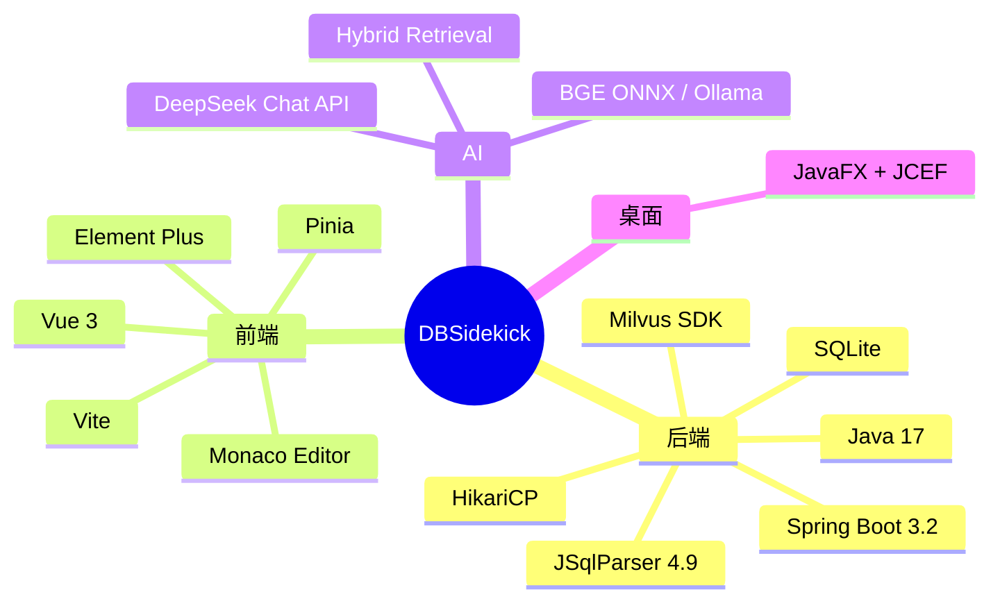

# DBSidekick 系统架构说明

> 版本：0.0.1  
> 定位：**本地化、多数据源、自然语言 → SQL** 的桌面查询助手  

---

## 1. 产品概述

DBSidekick（库旁助手）面向运维、分析师与业务人员，在**数据尽量不出内网**的前提下，提供：

| 能力 | 说明 |
|------|------|
| 自然语言查数 | Text2SQL：问句 → Schema 检索 → LLM 生成 → 门禁 → 执行 |
| 多数据源 | 动态连接 MySQL / PostgreSQL，按需建池 |
| Schema 资产 | 表结构同步、向量化入库（Milvus）、别名/用途增强 |
| SQL 门禁 | JSqlParser 只读校验、强制 LIMIT、脚本临时表约束 |
| 查询编辑器 | Monaco 手写 SQL、解释计划、AI 优化/解释 |
| 会话与脚本库 | 本地 SQLite 持久化对话、收藏脚本 |
| 桌面交付 | JavaFX 启动壳 + JCEF（Chromium）窗口，内嵌 Spring Boot |

**设计原则**：LLM 只负责「猜 SQL」，**能不能跑由门禁与执行层硬约束**；业务库只读查询，元数据落本地 SQLite。

---

## 2. 仓库与模块

```
DBSidekick/
├── pom.xml                    # Maven 父工程
├── dbsidekick-server/         # Spring Boot 3 后端（核心）
├── dbsidekick-web/            # Vue 3 + Vite 前端
├── dbsidekick-desktop/        # JavaFX 桌面壳（WebView）
├── data/                      # 本地 SQLite 等运行时数据
├── docs/                      # 简要文档入口
└── 系统架构说明.md             # 本文档
```

| 模块 | 技术 | 职责 |
|------|------|------|
| `dbsidekick-server` | Java 17 · Spring Boot 3.2 · JSqlParser · HikariCP · Milvus SDK | API、Text2SQL、门禁、数据源、向量检索 |
| `dbsidekick-web` | Vue 3 · Element Plus · Pinia · Monaco · Axios | 主 UI（可独立 `localhost:5173` 开发） |
| `dbsidekick-desktop` | JavaFX 17 + JCEF | 启动内嵌后端，用 Chromium 加载前端页面 |

---

## 3. 总体架构

### 3.1 逻辑架构



### 3.2 部署与进程关系



---

## 4. 后端包结构

```
com.dbsidekick
├── DBSidekickApplication          # 启动类
├── controller/                    # HTTP 入口
├── text2sql/                      # NL→SQL 流水线
├── sqlguard/                      # 解析、规范化、门禁、执行
├── schema/                        # 抽表、同步、别名、向量卡片
├── datasource/                    # 连接配置、动态池
├── ai/
│   ├── llm/                       # DeepSeekClient
│   ├── embedding/                 # ONNX / Ollama
│   ├── milvus/                    # Schema 向量库
│   └── hybrid/                    # 混合检索、Rerank
├── relation/                      # Join 关系沉淀（用量）
├── asset/                         # 会话、消息、脚本
└── config/                        # 设置、SQLite、异常、运行时 SQL 参数
```

### 主要 API

| 前缀 | 用途 |
|------|------|
| `GET /api/health` | 健康检查 |
| `/api/datasource/**` | 数据源增删改查、测连 |
| `/api/text2sql/stream` | **SSE** 流式 Text2SQL（主对话） |
| `/api/text2sql/query` | 同步 Text2SQL |
| `/api/text2sql/optimize` · `/explain` | AI 优化 / 解释 SQL |
| `/api/sql/execute` · `/explain-plan` | 编辑器执行 / 执行计划 |
| `/api/session/**` | AI 会话 |
| `/api/script/**` | 脚本库 |
| `/api/settings/**` | LLM / Embedding / Milvus / **SQL 门禁配置** |
| `/api/ai/**` | Embedding / Milvus 健康与测试 |
| Schema 相关 | 同步、别名生成等（`SchemaController`） |

---

## 5. Text2SQL 流水线（核心）

### 5.1 端到端流程



### 5.2 阶段与前端展示

前端 `AiChatTab` 按 SSE `phase` 事件展示「推理过程」；阶段间隙显示 **thinking…** 动画，避免长等待误判卡死。折叠/展开只控制整块面板，不改变单行内容。

`phase` 事件的 `data` 固定为：

```json
{ "phase": "检索Schema", "content": "命中 3 张表：sys_user, sys_dept, sys_role", "elapsedMs": 1523 }
```

每一行必须同时展示这三项，不能只留阶段名和耗时：

| 区域 | 展示 |
|------|------|
| 第一行 | 状态图标 + `phase` + `elapsedMs` |
| 第二行 | `content`。超过 80 字截断并加 `...`，悬停 tooltip 看全文 |
| 生成 SQL / 生成 SQL(重试) | 等宽字体、深色底 |
| 执行 | 绿色（如「返回 N 行」） |
| 安全校验不通过 | 红色（文案含「不通过 / 失败 / 危险 / 已拦截」）；通过仍为灰色 |

典型 phase：

1. 理解问题（含是否脚本模式）
2. 改写问题（追问 / 历史）
3. 检索 Schema
4. 检索示例（Few-shot）
5. 生成 SQL
6. 安全校验
7. 执行（成功行数 / 失败原因）
8. 必要时：生成 SQL（重试）

### 5.3 Prompt 与模型

- **模型**：设置页可选 `deepseek-v4-pro` / `deepseek-flash`（默认 pro）  
- **API Key**：优先设置页写入 SQLite；否则环境变量 `DEEPSEEK_API_KEY`  
- **Thinking**：`thinking.enabled` + `reasoning_effort=low`（质量与耗时折中）  
- **硬约束**：只读、真实表字段、派生表别名、脚本临时表规则、LIMIT 等  

---

## 6. SQL 门禁与执行（sqlguard）



### 关键能力

| 能力 | 说明 |
|------|------|
| 只读 | 禁止 INSERT/UPDATE/DELETE/DDL（脚本仅允许 TEMPORARY） |
| LIMIT | 可配置开关与默认值（默认 100）；结果行数同步上限 |
| 派生表别名 | AST 补 `AS` + 文本兜底，避免 `FROM (SELECT…) LIMIT` |
| 重复 LIMIT | UNION 场景清除子句 LIMIT，避免 `LIMIT 100 LIMIT 100` |
| 临时表 reopen | MySQL 同语句不可二次打开同一临时表 → 自动 `CREATE …_2 AS SELECT *` |
| 超时 | 默认查询超时 30s（可配置）；SSE/LLM 超时单独加长 |
| 脚本条数 | 默认最多 20，硬顶 200 |

配置入口：**配置 → SQL 配置**（落库 `app_settings`，键前缀 `sql.*`）。

---

## 7. Schema 检索与向量



- Embedding：默认本地 **ONNX BGE 768**；可切 Ollama  
- 集合名默认 `schema_chunks`  
- Few-shot：历史成功 SQL 向量检索，追问时过滤表交集  

---

## 8. 前端结构

```
dbsidekick-web/src
├── views/MainView.vue          # 壳：菜单 + Tab 容器
├── components/
│   ├── AppMenuBar.vue          # 工具 / 配置 / 帮助
│   └── tabs/
│       ├── AiChatTab.vue       # AI 对话（SSE 推理：阶段名 + content + 耗时）
│       ├── QueryEditorTab.vue  # SQL 编辑器
│       ├── ConnectionManageTab.vue
│       └── SettingsTab.vue     # LLM / Embedding / Milvus / SQL / 存储
├── stores/                     # Pinia：app / tabs
└── api/                        # Axios 封装
```

功能一览：

- **AI 会话**：流式推理步骤（每阶段展示 content）、结果表分页（10/20/50）、复制/打开编辑器/存脚本  
- **查询编辑器**：运行、停止、美化、AI 优化、解释、执行计划、脚本步骤页签  
- **连接管理**：多数据源  
- **配置**：模型（pro/flash）、API Key、SQL 门禁参数  

---

## 9. 本地数据与配置

| 项 | 位置 / 说明 |
|----|-------------|
| SQLite | `data/dbsidekick.db`（连接、会话、脚本、`app_settings`） |
| 应用日志 | `~/.dbsidekick/logs/dbsidekick.log` |
| YAML 默认 | `dbsidekick-server/.../application.yml` |
| 运行时覆盖 | 设置页 → SQLite（优先级高于 YAML / 环境变量） |

**LLM Key 解析顺序**：设置页 `llm.apiKey` → `DEEPSEEK_API_KEY` → YAML。

---

## 10. 技术栈一览



---

## 11. 安全边界（摘要）

1. **业务库**：默认只跑只读 SQL；脚本模式也禁止持久化写操作。  
2. **门禁不可绕过**：LLM 输出必须过 Guard 才执行。  
3. **结果集上限**：与默认 LIMIT / `setMaxRows` 对齐，防大结果拖垮客户端。  
4. **密钥**：不写死在仓库；UI 脱敏展示。  
5. **内网诉求**：Embedding / Milvus 可本地；LLM 当前默认走 DeepSeek 云端（可后续接本地模型）。

---

## 12. 本地开发速览

```powershell
# 后端（需 JDK 17）。JAVA_HOME 指向 <JDK 目录>
cd <项目根>
mvn -pl dbsidekick-server -am package -DskipTests
java -jar dbsidekick-server\target\dbsidekick-server-0.0.1-SNAPSHOT-boot.jar

# 前端
cd dbsidekick-web
npm run dev   # http://127.0.0.1:5173  proxy → :8080

# 桌面 exe（前端构建 → 打进后端静态资源 → jpackage）
# 打包前先停掉正在运行的 DBSidekick.exe 和占用 server jar 的 8080 进程
dbsidekick-desktop\build-exe.bat
# 产物：dbsidekick-desktop\dist\DBSidekick\DBSidekick.exe
```

依赖建议：

- Milvus（Schema 向量检索）  
- DeepSeek API Key  
- 可选：ONNX BGE 模型目录（见 `application.yml`）

---

## 13. 关键设计决策（备忘）

| 决策 | 原因 |
|------|------|
| SSE 推 phase | 长链路可观测；前端 thinking 动画填补空窗。每条 phase 带 content，界面必须展示，不能只留阶段名和耗时 |
| 失败只重试 1 次 | 控制成本与超时，配合针对性 retry Prompt |
| 脚本 + 临时表 | 复杂分析可拆步；用复制表规避 MySQL reopen |
| 设置落 SQLite | 桌面场景免改 YAML，热更新多数配置 |
| 门禁规范化 LIMIT | 防止 LLM 漏 LIMIT 或 UNION 双重 LIMIT |

---

## 14. 文档维护

- 本文档随架构变更更新；实现细节以代码为准。  
- 简要入口：`docs/README.md`  
- 问题排查优先看：`~/.dbsidekick/logs/dbsidekick.log` 与前端推理步骤。
